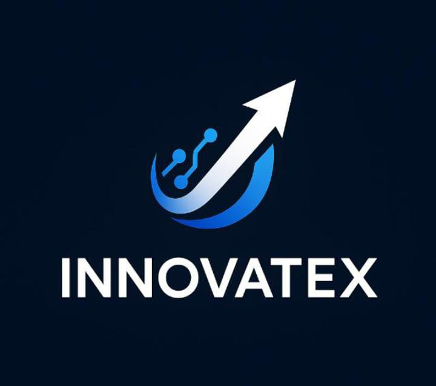

<p align="center">
  
</p>

# InnovateX – Voice Controlled Robot & Voice Assistant Engine 🤖🎤

# InnovateX – Voice Controlled Robot & Voice Assistant Engine 🤖🎤

InnovateX is a final-year engineering project that integrates a custom-built **Voice Assistant Engine** with a **Voice Controlled Robot**. It demonstrates how speech recognition, embedded systems, and automation can create an intelligent hands-free robotic system.

---

## 🚀 Project Overview
InnovateX enables users to control a robot using real-time voice commands. Spoken input is processed by the voice assistant engine, converted into actions, and transmitted to the robot via Bluetooth or Wi-Fi. The assistant also supports modular commands, responses, and automation logic.

---

## ✨ Key Features
- 🎤 **Custom Voice Assistant Engine**
- 🤖 **Robot control via voice** (Forward, Backward, Left, Right, Stop)
- 🔗 **Bluetooth / Wi-Fi (ESP32 or Arduino) communication**
- 🔊 **Offline + Online speech recognition**
- ⚙️ **Motor drivers: L298N / L293D**
- 🧠 **Modular architecture to add new commands easily**
- 🪶 **Lightweight Python + microcontroller firmware**

---

## 🛠️ Tech Stack
- **Python** – Voice processing & assistant logic  
- **Arduino / ESP32** – Robot firmware  
- **Speech Recognition Libraries**  
- **Motor Driver Boards**  
- **Bluetooth / Wi-Fi Modules**

---
## 📂 Repository Structure
```
InnovateX/
│── assistant_engine/      # Voice assistant core logic
│── robot_controller/      # Microcontroller firmware
│── models/                # Speech/intent models
│── scripts/               # Helper scripts & tools
│── docs/                  # Diagrams, documentation
│── README.md
```


---

## 📚 How It Works
1. User speaks a command.  
2. Voice engine converts speech → text → intent.  
3. Intent is mapped to robot action.  
4. Command is sent to robot via Bluetooth/Wi-Fi.  
5. Robot performs the action instantly.

---

## 🎯 Applications
- Final-year engineering research  
- Voice-controlled robotics  
- IoT automation projects  
- Assistive technology  
- AI-powered embedded systems  

---

## 🧪 Future Enhancements
- Wake-word detection (e.g., “Hey InnovateX”)  
- Obstacle detection using sensors  
- Camera-based navigation  
- Cloud-connected learning  
- Advanced NLP conversation model  

---

## 📜 License
This project is licensed under the **MIT License**.

---

## 🤝 Contribution
Contributions, issues, and improvements are welcome.  
Fork the repo and help InnovateX grow!

If you like this project, please ⭐ the repository!
